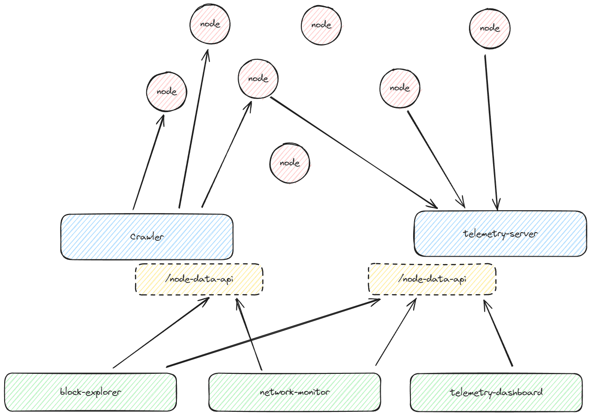

# Node Data API

Each of the nodes (Juno, Madara, Papyrus, Pathfinder, etc.) **MUST** implement standard peer-to-peer (p2p) communication and **MAY** implement node data telemetry.

### **Network Information Collection:**

- **Crawlers**: Collect network information by connecting to nodes via p2p.
- **Telemetry Servers**: Have a public endpoint open for nodes to report data via WebSocket.

### **Node Data API**:

- Exposed by crawlers and telemetry servers.
- Standardized using JSON-RPC.

### **Integration**:

- Network monitoring tools, visual dashboards (e.g., network dashboards, block explorers), etc., connect to node data API endpoints to retrieve information.
- These tools **MAY** aggregate data as needed.

The diagram below illustrates the interaction between nodes, crawlers, telemetry servers, and various network monitoring tools:

1. **Nodes** communicate with each other via p2p.
2. **Crawlers** connect to nodes to collect network information.
3. **Telemetry Servers** receive data reports from nodes.
4. **Node Data API** endpoints are provided by crawlers and telemetry servers.
5. Network tools like **block explorers**, **network monitors**, and **telemetry dashboards** use these endpoints to access and display node data.



### Telemetry WebSocket API

The client implementations shall connect to a telemetry server via a WebSocket to stream telemetry data as a continuous stream. 

- The Clent will allow to specify the telemetry endpoint URL, which will be used to upload telementry data. 
- Clients are expected to follow the JSON data structure as payload in subsequent data updates:

```json

{
    "type": "object",
    "properties": {
        "Node": {
            "type": "object",
            "properties": {
                "name": {
                    "type": "string",
                    "description": ""
                },
                "peer_id": {
                    "type": "string"
                },
                "client": {
                    "type": "string"
                },
                "version": {
                    "type": "string"
                },
                "capability": {
                    "type": "string",
                    "enum": [
                        "FullNode",
                        "Sequencer"
                    ]
                }
            }
        },
        "Network": {
            "type": "object",
            "properties": {
                "Network": {
                    "type": "string"
                },
                "Starknet_version": {
                    "type": "string"
                },
                "JSON_RPC_version": {
                    "type": "string"
                },
                "current_block_hash_l2": {
                    "type": "string"
                },
                "current_block_number_l2": {
                    "type": "string"
                },
                "current_block_hash_l1": {
                    "type": "string"
                },
                "current_block_number_l1": {
                    "type": "string"
                },
                "latest_block_time": {
                    "type": "integer",
                    "description": "Expressed in ms"
                },
                "avg_sync_time": {
                    "type": "integer",
                    "description": "Expressed in ms"
                },
                "estimate_sync": {
                    "type": "number",
                    "description": "Expressed in ms"
                },
                "tx_number": {
                    "type": "integer"
                },
                "event_number": {
                    "type": "integer"
                },
                "message_number": {
                    "type": "integer"
                },
                "peer_count": {
                    "type": "integer"
                }
            }
        },
        "System": {
            "type": "object",
            "properties": {
                "node_uptime": {
                    "type": "number"
                },
                "operating_system": {
                    "type": "string"
                },
                "memory": {
                    "type": "integer",
                    "description": "Expressed in MB"
                },
                "memory_usage": {
                    "type": "number",
                    "description": "Expressed in %"
                },
                "CPU": {
                    "type": "integer",
                    "description": "Number of cores"
                },
                "CPU_type": {
                    "type": "string"
                },
                "CPU_usage": {
                    "type": "integer",
                    "description": "Expressed in %"
                },
                "storage": {
                    "type": "integer",
                    "description": "Expressed in MB"
                },
                "storage_usage": {
                    "type": "number",
                    "description": "Expressed in %"
                }
            }
        }
    }
}


```

**NOTE:** the fields in the schema are marked as NOT required, ie. it is possible to upload partial data for subsequent events. 
The client is only required to send fields which it wants to share. The first payload upladed after starting the client should include basic identification data (ie. `name`, `peer_id`, `client`, `version` `capability`). The subsequent payloads may only include `Network`-related fields. The telemetry server will use the unique websocket ID to match incoming payload records to respective Peer_ID.


- Example websocket data feed

(TBA)


### REST API:

Endpoint: `/api/nodes`

Method: `GET`

```json
{
  "$schema": "http://json-schema.org/draft-07/schema#",
  "title": "Node Data API Response",
  "type": "array",
  "items": {
    "type": "object",
    "properties": {
      "nodeId": {
        "type": "string"
      },
      "nodeIp": {
        "type": "string",
        "format": "ipv4"
      },
      "nodeName": {
        "type": "string"
      },
      "nodeClientVersion": {
        "type": "string"
      },
      "nodeClientType": {
        "type": "string"
      },
      "cpuUsage": {
        "type": "number"
      },
      "memoryUsage": {
        "type": "number"
      },
      "networkTraffic": {
        "type": "number"
      },
      "blockHeight": {
        "type": "number"
      }
    },
    "required": ["nodeId"]
  }
}
```
